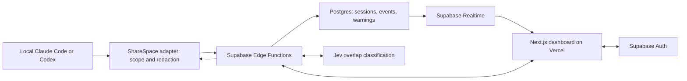

# ShareSpace — resolved v1 product requirements

**Version:** 1.0 · **Updated:** October 3, 2026

This is the canonical product specification for ShareSpace v1. It replaces the two original PRDs and reflects the decisions made during reconciliation. The repository is a starter; requirements below are targets, not claims of implemented or verified behavior.

Related documents: [teammate ownership](docs/WORK_SPLIT.md), [implementation gates](docs/BUILD_PLAN.md), [decision history](docs/DECISIONS.md), and [starter status](docs/STATUS.md). The decision history is an audit record, not a second active specification.

## 1. Product and outcome

ShareSpace helps two builders working in the same repository see what each other's coding agents are doing and notice overlapping work before they duplicate effort.

The first version provides shared agent sessions and advisory overlap warnings. Builders coordinate through their existing workflow after seeing a warning. ShareSpace does not run their coding agents or decide that work is complete.

The demo succeeds when two authenticated builders can share real Claude Code and Codex activity, inspect each other's sessions, and receive a grounded overlap warning without interrupting their coding workflow.

## 2. Release scope

| Area | V1 requirement |
| --- | --- |
| Team and repository | One team and one linked repository in the initial experience; demonstrate with two independent accounts |
| Agents | Both Claude Code and Codex, through local adapters with tested version/capability support |
| Work tracking | Shared sessions, recent requests, branch context, and observed activity |
| Sharing | Explicit repository opt-in, then automatic sharing for subsequent sessions; pause/private-session controls |
| Coordination | Advisory overlap warnings, model scores, and supporting teammate/session links |
| Existing-code checks | The user's own coding agent searches the local repository |
| Backend | Supabase Edge Functions, Auth, Postgres, and Realtime |
| Website | Next.js on Vercel |
| History | A storage-based rolling window with warnings and oldest-first cleanup |

Stripe and all billing work come after v1. Cursor, multiple teams, task boards, negotiated resolutions, continuation packets, source indexing, dedicated heartbeats, and automated personal-content screening are outside this release.

DeepSeek summarization is a proposed extension described in section 9. It is not a required dependency or a claim that the user's endpoint has been tested.

Large-output handling has not received a final A/B/C selection. Bounded excerpts below are an interim implementation default and the fallback shared by the proposed approaches; they are not recorded as a new user-approved choice. Additional file retention or summarization remains outside the committed release requirements until selected.

## 3. Primary user journeys

### Join and connect

1. A builder signs in through Supabase Auth. GitHub sign-in is the intended web onboarding flow.
2. They create the team and identify its repository, or sign in and accept a reusable team invitation.
3. They install/run the local ShareSpace adapter and approve its connection in the browser.
4. The connection grants a separate ShareSpace device credential scoped to the approved user/repository and adapter operations.
5. They enable sharing for that repository and see the destination, captured categories, redaction behavior, provider processing, and history-cleanup policy.

### Share and inspect work

1. Claude Code or Codex produces a supported prompt, response, tool, or session event locally.
2. The adapter verifies repository scope and sharing state, sanitizes the event, and sends bounded content to the backend.
3. The backend authenticates the connection, checks current membership/scope and storage capacity, and persists the event without duplicate delivery.
4. The teammate's dashboard updates. Opening the session shows the available conversation and tool activity with timestamps and capture limitations.
5. Pausing or making a session private prevents further sharing. Manual deletion removes the owner's stored shared content.

### Receive an overlap warning

1. A shared implementation request is checked against authorized recent teammate/session context from the same repository.
2. Jev classifies the request and its relationship to candidate work.
3. A likely overlap produces an advisory warning with the teammate/session reference, supporting context, and a correctly labeled numeric model score when supplied.
4. The warning reaches the dashboard and the coding agent at a supported integration boundary. Builders decide how to coordinate.
5. If the check fails or times out, show “Overlap check unavailable — continuing.” The coding agent continues.

## 4. Functional requirements

### FR-01 — Identity, membership, and invitations

- Require authentication before accessing real team data. Distinguish team admin and member permissions.
- Admins can create/copy/rotate the reusable invitation link and remove members. A signed-in user with a valid link joins as a member.
- Rotation prevents future joins through the old link; it does not remove existing members.
- Single-use invitations and automatic invitation expiry are deferred for the demo.
- Every sensitive read or mutation checks current membership and resource scope. Submitted user IDs, repository names, or URL slugs are not authorization.
- The demo needs two accounts; commercial member limits are a later billing decision.

### FR-02 — Local connections and credentials

- Support both Claude Code and Codex with version-tested capture and warning-delivery capabilities. Show unsupported or partial capability states instead of fabricating missing events.
- Use browser-approved, independently revocable device credentials for the selected repository. Store credentials securely on the device; do not expose them through logs or shared events.
- These credentials authenticate the adapter to ShareSpace. Do not reuse or upload Claude Code/Codex account or subscription credentials.
- Revoking a device or removing its user's membership denies subsequent uploads and authorized reads. Recovery instructions must be visible.
- Exact hook names, callback details, and supported versions must be verified during the compatibility spike; source PRD examples are not evidence of support.

### FR-03 — Sharing and privacy

- Sharing starts disabled for unlinked repositories. Enabling it once for a repository permits subsequent sessions there to share automatically.
- Provide persistent sharing indicators and pause/private-session controls. Changing the default affects future capture, not automatic deletion of already shared history.
- Stop capture/upload for private or paused sessions. Do not flush previously queued content after a pause without an explicit policy that preserves the user's sharing choice.
- Redact secrets locally before upload or any optional summarizer request. Respect repository boundaries, path exclusions, and safe relative paths.
- Exclude raw environment variables, credentials, hidden reasoning, unrelated files, and complete terminal history. Do not write source content to analytics or operational logs.
- No automatic personal-content classifier is required in v1. Manual privacy controls and local redaction remain required.

### FR-04 — Capture, storage, and delivery

| Stored category | Content |
| --- | --- |
| Session metadata | Owner, repository, agent/version, branch when available, sharing state, timestamps, capture capabilities |
| Conversation events | Shared user prompts and user-visible agent responses, with redaction/truncation markers |
| Tool events | Tool name, bounded sanitized arguments/results, execution status, safe relative paths, correlation IDs |
| Change context | Changed-file metadata and bounded redacted diff excerpts where supported |
| Overlap records | Check outcome, model score/meaning when available, source references, and related sessions |

- Store metadata in relational Postgres rows and event content in bounded JSONB fields. A session is a sequence of events, not a single growing database document.
- Keep exact compact evidence alongside any future generated summary. Do not promise full raw outputs, recoverable patches, or complete capture when only excerpts are available.
- Establish byte limits in the shared contract before integration. The starter's 16 KiB event envelope and bounded batches are starting constraints to reconcile with both consumers, not permission for unbounded logs.
- Use stable event IDs, deduplication, acknowledgements, and ordered read cursors. Retries must not duplicate events or resurrect deleted history.
- Use a bounded local retry queue. Distinguish transient network failure, revoked access, private state, and storage refusal so retry behavior cannot consume unlimited disk.
- Keep short observed content exact when possible. For oversized content, start with the interim bounded-excerpt path and visible truncation described in section 2. Large-output file storage is not a v1 promise.

### FR-05 — Dashboard and session viewer

- Show each builder's agent, repository/branch context, recent request, sharing state, and last observed activity.
- Use labels such as “Last activity 2 minutes ago.” No separate periodic heartbeat mechanism is required for the demo.
- Recent activity does not prove current connectivity; silence or a session-end event does not prove a feature is complete. Delayed retries must not appear as newly performed work.
- Render prompts/responses as a conversation, with collapsible tool details, status, timestamps, and redaction/truncation indicators.
- Support pagination, event filtering, search within the selected session, and stable links to relevant events. Cross-session transcript search is deferred.
- Follow incoming activity only when the reader is at the bottom. Provide an explicit jump-to-latest action and recover missed updates through persisted reads.
- Show loading, empty, partial capture, paused/private, unavailable, access-revoked, removed-history, and storage-paused states. Keep sample fixtures visibly separate from real accounts/data.

### FR-06 — Jev and advisory overlap checks

- Supply Jev only authorized, redacted intent and recent teammate/session evidence from the same repository.
- Ask whether the incoming request is an implementation request and whether candidate work is overlapping, related, or unrelated. Validate responses against the shared contract and authorized source references.
- Preserve exact user intent and reliable event metadata where available. A summary alone is not authoritative proof of code behavior.
- Persist meaningful overlap warnings and avoid duplicate warnings caused by network retries.
- Include the warning, relevant context, related-session link, and numeric score when available. Verify the provider's score semantics before using a percentage label; do not invent missing confidence or describe it as measured accuracy.
- Distinguish a completed check with no overlap found from a failed, incomplete, or unavailable check. Continue local coding in every case; no approval dialog or blocking review mode is required.
- For implementation requests, use the supported agent integration to instruct the local coding agent to search for an existing implementation. Jev does not independently inspect the local filesystem.
- Exact provider API shape, context limits, thresholds, timeouts, and injection behavior require a tested integration. Do not adopt unverified endpoints from the old documents.

### FR-07 — Storage-based rolling history

History has no fixed age-based expiry. It remains available while the storage window permits it. Starting demo thresholds use decimal MB:

| Boundary | Required behavior |
| --- | --- |
| 50 MB per person | Maximum accounted shared-history content across that user's repositories |
| Projected 40 MB per person | Warn that older history is being removed; prune oldest inactive stored sessions |
| 30 MB per person | Stop pruning when accounted usage is at or below this target |
| 350 MB actual shared database size | Warn and initiate eligible cleanup/maintenance |
| Projected 400 MB actual shared database size | Pause new session-content writes if safe capacity cannot be established |

- Reserve bytes atomically before accepting batches so concurrent requests cannot spend the same quota. Reconcile counters and inspect fresh server-side database measurements; daily dashboard metrics alone are insufficient.
- Account for all retained session content and derived excerpts. Remove related stored content and invalidate cached copies when source history is pruned.
- Protect the current active session. If eligible older history cannot free sufficient room, pause new shared uploads before the ceiling and show the reason; local coding continues. An indefinitely active session does not bypass quota checks.
- Do not delete another user's below-threshold history merely to satisfy one person's allowance. Aggregate database pressure can pause ingestion even when a person's logical quota has room.
- Resume only after verified safe headroom. Unknown capacity is not assumed free capacity. Quota refusal must not cause an unlimited local spool.
- Cleanup affects ShareSpace's stored copies, never the original local agent conversations or repository files. Old links show “History removed” rather than stale cached content.
- Explain the rolling policy when enabling sharing and surface notices when cleanup occurs.

The per-person budget measures retained content; actual database usage also includes indexes, other tables, and maintenance overhead. Row deletion need not immediately shrink physical storage. These are conservative starting thresholds to validate under real and concurrent workloads, not a claim that the implementation already guarantees staying below a provider limit. Capacity must be checked again as users are added. See [Supabase database size](https://supabase.com/docs/guides/platform/database-size).

## 5. Architecture and data boundaries

- **Vercel:** web hosting, rendering, and web authentication/session integration. Keep privileged application mutations, event ingestion, and Jev execution in Edge Functions.
- **Supabase Auth:** user identity. **Postgres/RLS:** persistent state and membership-scoped access. **Realtime:** authorized change notifications backed by recoverable persisted reads.
- **Local adapter:** repository consent, credential storage, redaction, capture, bounded retries, and supported warning delivery.
- **Jev:** classification from supplied context. Provider secrets stay server-side.
- **Shared core:** versioned, bounded TypeScript/Zod contracts used by browser, adapter, and backend.
- Supabase Compute and a hosted coding-agent runtime are not required for v1.

Logical data entities are users, teams/memberships, repository links, invitations, devices/credential hashes, sessions, events, overlap checks/warnings, and storage-usage/cleanup state. The final schema must follow this scope. The starter's task, source-index, resolution, handoff, and billing tables do not make those features mandatory.

## 6. Reliability and access requirements

- Enforce membership and device/repository scope on sensitive operations; keep RLS enabled and test unauthorized access independently of the UI.
- Treat prompts, tool results, diffs, and summaries as untrusted content. Render safely, delimit classifier input, and validate fixed output contracts.
- Make retries, duplicate submissions, deletion, revocation, and quota reservations safe under concurrency.
- Bound request sizes, queued bytes, provider input/output, and processing time. Provider failures return unavailable; they do not become a clear verdict.
- Measure real capture-to-dashboard delay and prompt-check latency before claiming responsiveness. Choose a bounded timeout compatible with both tested agents.
- Use separate sample and live paths. A fixture, successful HTTP response, or unit test alone does not prove real agent/provider or multi-user operation.

## 7. Delivery ownership and order

| Owner | Boundary |
| --- | --- |
| Teammate 1 | Browser UX, web authentication/session integration, user-scoped reads/Realtime, Vercel, browser/E2E testing |
| Teammate 2 | Claude Code/Codex adapters, credential and membership enforcement, Supabase schema/RLS/Edge Functions, Jev, storage accounting/cleanup |
| Shared contract | Teammate 2 drafts `packages/core` changes; both review before dependent implementation |

Use [WORK_SPLIT.md](docs/WORK_SPLIT.md) for the detailed feature/file split and [BUILD_PLAN.md](docs/BUILD_PLAN.md) for integration gates. Start with contracts and both-agent compatibility, then one real shared event, then complete session sharing, warnings, retention, and the deployed demo.

Every new feature uses a separate branch. Pushes or merges to `main` require an explicit human request for that change. Follow `AGENTS.md` and `CLAUDE.md`; implementation does not imply permission to publish to `main`.

## 8. V1 acceptance criteria

1. Two independent users sign in, join the same team through a reusable invitation, and connect repository-scoped devices. Rotating the invitation prevents reuse of the previous link.
2. Real Claude Code and Codex sessions produce supported events in the other user's dashboard. Unsupported categories/versions are disclosed.
3. A real deliberately overlapping implementation request produces a Jev-backed advisory warning in the dashboard and actual coding-agent integration, with a valid related-session link and meaningful score labeling.
4. A non-overlapping result and an unavailable check are distinguishable. A provider timeout does not block local coding.
5. Private/unlinked activity is not uploaded. A known test secret is absent from sent payloads, stored content, and logs.
6. Revocation/member removal prevents subsequent reads/uploads. An unrelated account cannot obtain session content through direct API/database requests or Realtime.
7. Reconnect/retry tests produce no duplicate events; pagination and session links remain usable; removed history does not reappear.
8. Quota warnings, pruning, active-session protection, and upload pausing work with simultaneous uploads and cleanup failures. Logical content quotas and actual shared database size are verified separately.
9. The Vercel web app and Supabase backend pass a real two-builder walkthrough. Appropriate code, database, and browser tests pass; mocks are not the only evidence.
10. The product presents a session-and-warning workflow without requiring deferred task/resolution or billing features.

## 9. Deferred and proposed work

### Billing — after v1

The future product idea is a $20 Stripe subscription that permits additional teammates and repositories. Billing frequency, per-team/per-person pricing, and free/paid limits remain undecided. No billing UI, upgrade prompts, payment integration work, subscription entitlements, or billing-specific acceptance gates are part of v1. Existing sandbox code is a scaffold only.

### DeepSeek summaries — proposed optional extension

The user proposed using an existing DeepSeek endpoint to reduce large tool outputs/diffs. The endpoint/model and this extension have not been validated or finalized. V1 can ship its bounded-excerpt path without this dependency.

If adopted, retain deterministic source metadata, exact errors, and small relevant excerpts alongside a clearly labeled, byte-bounded summary. Redact locally before sending content to the model; disclose the additional processor. Validate output, accept it only when smaller, process outside the prompt-check critical path, and fall back to excerpts on failure. Summaries remain lossy; they cannot reconstruct discarded code or prove correctness. All retained content counts toward the rolling window. Benchmark fidelity, latency, and total API/storage cost before enabling it.

Gemini remains optional. Cursor, broader team/repository support, large-output archives, and richer coordination can be revisited after the core demo.

## 10. Implementation status

The existing repository contains a labeled sample UI, separate real-auth foundation, draft schema/contracts, a preview-only local adapter, and optional provider/billing scaffolds. It does not yet prove live ingestion, both-agent compatibility, Jev warnings, rolling cleanup, deployed collaboration, or production readiness. Use [STATUS.md](docs/STATUS.md) for checkpoint evidence and update it as implementation is verified.
